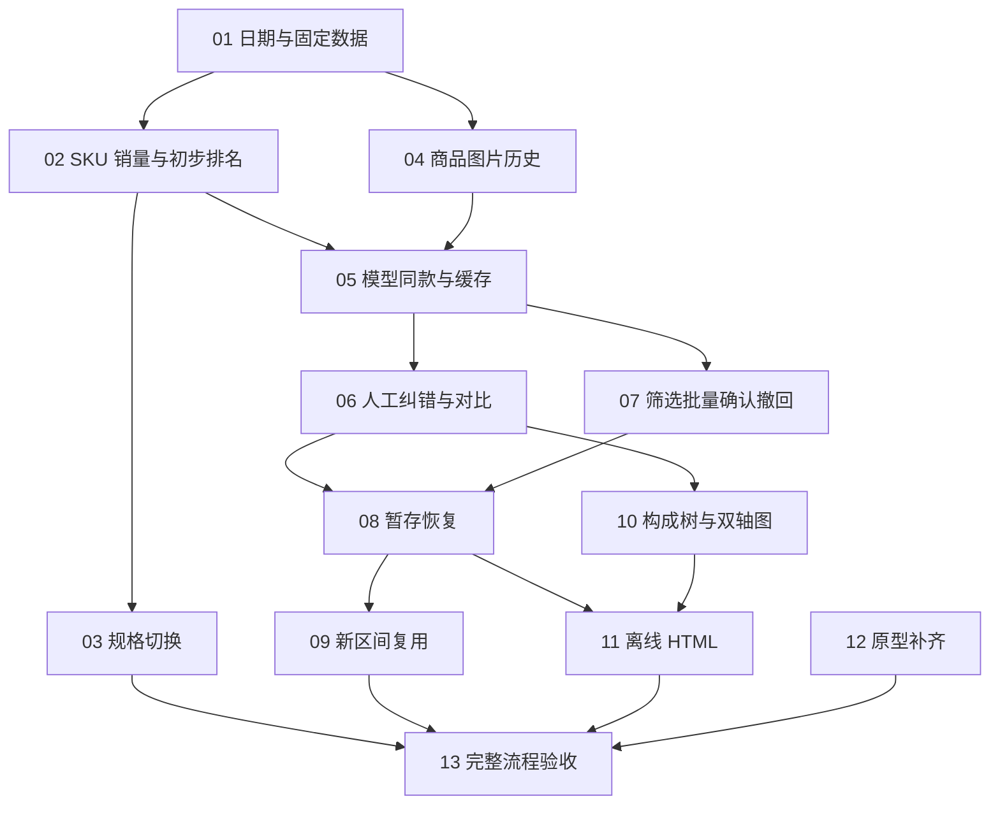

# 异步畅销品分析：实施工单总览

Approval: approved

日期：2026-09-20  
来源：[功能规格](spec.md)  
状态：用户已确认拆分粒度及依赖；13 票已逐一发布为 `ready-for-agent`。实施仍须满足每票的 Blocked by；父规格保持不变。

## 拆分原则

- 按可演示的用户行为拆分，每票包含所需数据、服务、页面接线及浏览器验收；不拆成“先建全套表／再写全部 API／最后写页面”。
- 优先复用库存提交、数据库迁移、采集进程判断和现有浏览器验收方法。现有边界足够，不安排跨仓预重构票；必要的小整理随对应切片完成。
- 正式功能从独立分析页面贯通真实本地接口和临时数据库，外部模型／图像网络可用固定响应；不能用整套假分析 API 冒充业务闭环。
- 每票验收先于最终整体验收。13 只复核组合行为及完整规模，不集中补写前面所有测试。
- 12 是可独立审阅的原型交付，不阻塞正式实现；原型本地存储不能充当正式数据库。
- 工单正文引用父规格条目和验收编号，不固定未来代码文件名、表名或私有函数签名。

## 编号、交付与直接依赖

| 编号 | 工单 | 直接依赖 | 完成后可演示的行为 |
| --- | --- | --- | --- |
| 01 | [选择日期并固定一次分析](issues/01-start-frozen-analysis.md) | 无 | 独立打开页面，查看两日真实覆盖，固定库存，进入真实商品待确认列表 |
| 02 | [按 SKU 计算销量并查看初步排名](issues/02-sku-sales-first-ranking.md) | 01 | 逐日缺失／补货计算正确，人工确认独立组后查看单商品排名与库存图 |
| 03 | [规格切换不重复计库存与销量](issues/03-sku-representation-segments.md) | 02 | 单规格与多规格往返切换时，页面库存和累计销量无虚假跳增 |
| 04 | [保存并展示历史商品图片](issues/04-historical-product-images.md) | 01 | 采集新商品版本后，选旧日期仍能查看旧图；缺历史图有明确占位 |
| 05 | [模型同款建议与版本缓存](issues/05-model-matching-and-cache.md) | 02、04 | 基于名称和图像形成跨店待确认组，再次分析复用未变信息的判断 |
| 06 | [对比候选并人工纠正分组](issues/06-compare-and-edit-groups.md) | 05 | 从对比弹窗或右侧详情增删成员，排除关系、确认状态和单品入口正确 |
| 07 | [全量筛选、批量确认与撤回](issues/07-review-at-scale.md) | 05 | 3,000+ 商品跨页搜索筛选、批量确认，已确认组可撤回 |
| 08 | [暂存并在关闭后恢复原分析](issues/08-save-and-resume-analysis.md) | 06、07 | 保存全部整理进度，重启程序恢复原快照，失败和未保存离开有反馈 |
| 09 | [新日期区间复用人工判断](issues/09-reuse-decisions-across-ranges.md) | 08 | 换日期重新算销量，保留适用人工判断，不删除未入选的历史成员 |
| 10 | [跨店同款构成树与完整双轴图](issues/10-bestseller-tree-and-charts.md) | 06 | 查看整组排名、代表商品、店铺商品 SKU 树，以及可读的双轴明细图 |
| 11 | [导出可独立打开的 HTML 报告](issues/11-offline-html-report.md) | 08、10 | 保存完整结果到 output，关闭服务后仍可展开图片、图表和 SKU 明细 |
| 12 | [补齐原型中的最新确认交互](issues/12-complete-agreed-prototype.md) | 无 | 在原型中核对纯展示标签、来源链接、暂存重开和最新边界场景 |
| 13 | [完整浏览器流程与真实样本验收](issues/13-end-to-end-acceptance.md) | 03、09、11、12 | 12 店铺和 3,012 商品下，从选日期走到重启恢复、新区间复用及离线报告 |

## 依赖说明

- 01 完成后，02 的计算链与 04 的历史图片链可独立推进；12 从一开始就可推进。
- 05 需要可计算的商品销量和可靠的信息版本，故依赖 02、04，不必等待规格切换专项 03。
- 06、07 都在 05 的可显示分组之上扩展，互不阻塞；08 必须在两种人工操作均存在后验证完整草稿保存。
- 10 使用 06 产生的真实人工分组并读取共享计算结果；03 扩充计算边界，不是 10 开始展示普通库存图的必要条件。两者组合在 13 复核。
- 09 扩充跨分析的人工决策复用，不阻塞仅导出当前分析的 11。11 需要完整结果展示和已持久保存的分析，故依赖 08、10。
- 13 的四个直接前置覆盖全部其他票，不重复列出传递依赖。依赖图无环；可领取顺序由前置完成状态决定，而非必须按编号串行。

## 规格验收归属

“主责”表示必须在该票完成时验证；13 复核完整链路，不替代主责票。跨票场景按各票具体范围分别验收。

| 规格场景 | 主责票 | 组合补验 |
| --- | --- | --- |
| A01—A08 | 02 | 10 的图表呈现 |
| A09—A10 | 03 | 10、13 |
| A11—A14 | 01 | 08、11 的固定数据消费 |
| A15—A16 | 05 | 09 的跨分析复用 |
| A17 | 04 的图像版本、05 的缓存失效 | 09 的人工处理 |
| A18 | 05 | 04 的缺图事实 |
| A19 | 04 | 08、11 的资产恢复与离线 |
| A20—A23 | 06 | 08 的持久保存 |
| A24 | 07 的工作状态、08 的保存重启 | 09 |
| A25—A27 | 07 | 13 |
| A28 | 02 | 07 的批量路径区分 |
| A29 | 04 的右侧链接、06 的弹窗链接、07 的不可点击标签 | 12 的原型同步 |
| A30—A33 | 06 | 04 的主图能力、12 的原型同步 |
| A34 | 06、07 | 12 |
| A35—A36 | 08 | 09 的新旧分析区分 |
| A37 | 09 | 13 |
| A38—A39 | 08 | 02 的进入结果资格基础 |
| A40 | 10 | 09 的区间切换 |
| A41—A43 | 10 | 11 的离线一致性 |
| A44—A45 | 11 | 13 |
| A46 | 12 | 13 的正式与模拟证据区分 |

## 发布记录

- 2026-09-20：用户回复“没问题，改状态”，确认 13 票粒度及依赖，全部正式发布为 `ready-for-agent`。
- 当前 01、02 已完成（resolved）；可开始 03、04、12，其余待所列依赖完成后再领取。
- 本轮未开始实现，验收清单仍全部未勾选，父规格未修改。

## 实施进展

- 2026-09-20：01 已完成，提交 d82ab8e、30fa608；全套 481 项通过，审查修正后 5 项定向通过。其余工单状态不变，尚未开始实现。
- 2026-09-20：02 已完成 SKU 销量和初步排名实现；全套 484 项通过。
