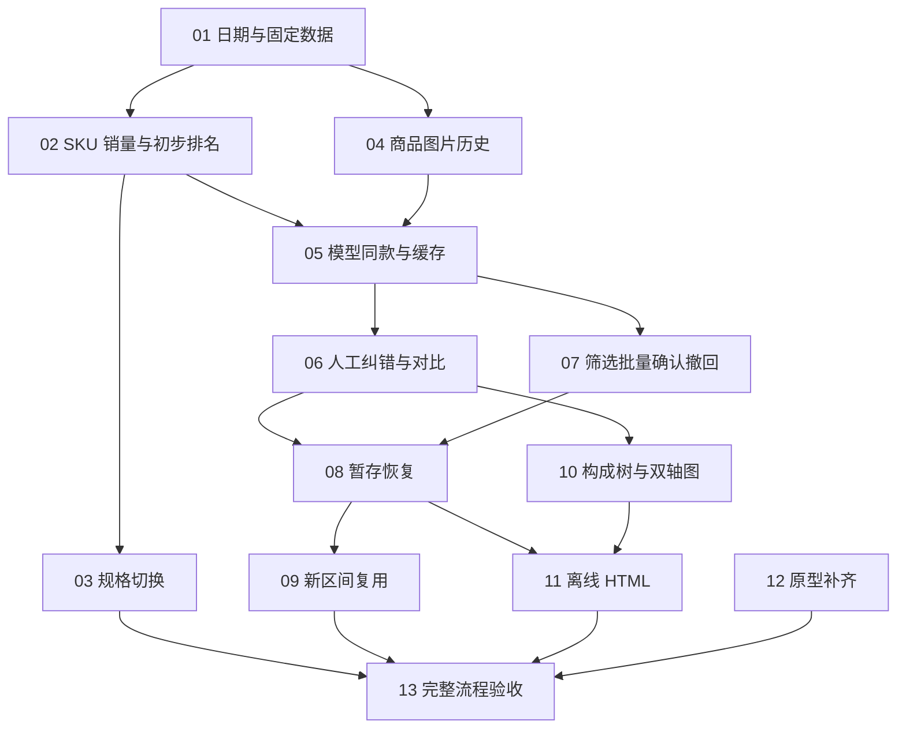

# 异步畅销品分析：实施工单总览

Approval: approved

日期：2026-09-20  
来源：[功能规格](spec.md)  
状态：用户已确认拆分粒度及依赖；13 票已逐一发布为 `ready-for-agent`。实施仍须满足每票的 Blocked by；父规格保持不变。

## 拆分原则

- 按可演示的用户行为拆分，每票包含所需数据、服务、页面接线及浏览器验收；不拆成“先建全套表／再写全部 API／最后写页面”。
- 优先复用库存提交、数据库迁移、采集进程判断和现有浏览器验收方法。现有边界足够，不安排跨仓预重构票；必要的小整理随对应切片完成。
- 正式功能从独立分析页面贯通真实本地接口和临时数据库，外部模型／图像网络可用固定响应；不能用整套假分析 API 冒充业务闭环。
- 每票验收先于最终整体验收。13 只复核组合行为及完整规模，不集中补写前面所有测试。
- 12 是可独立审阅的原型交付，不阻塞正式实现；原型本地存储不能充当正式数据库。
- 工单正文引用父规格条目和验收编号，不固定未来代码文件名、表名或私有函数签名。

## 编号、交付与直接依赖

| 编号 | 工单 | 直接依赖 | 完成后可演示的行为 |
| --- | --- | --- | --- |
| 01 | [选择日期并固定一次分析](issues/01-start-frozen-analysis.md) | 无 | 独立打开页面，查看两日真实覆盖，固定库存，进入真实商品待确认列表 |
| 02 | [按 SKU 计算销量并查看初步排名](issues/02-sku-sales-first-ranking.md) | 01 | 逐日缺失／补货计算正确，人工确认独立组后查看单商品排名与库存图 |
| 03 | [规格切换不重复计库存与销量](issues/03-sku-representation-segments.md) | 02 | 单规格与多规格往返切换时，页面库存和累计销量无虚假跳增 |
| 04 | [保存并展示历史商品图片](issues/04-historical-product-images.md) | 01 | 采集新商品版本后，选旧日期仍能查看旧图；缺历史图有明确占位 |
| 05 | [模型同款建议与版本缓存](issues/05-model-matching-and-cache.md) | 02、04 | 基于名称和图像形成跨店待确认组，再次分析复用未变信息的判断 |
| 06 | [对比候选并人工纠正分组](issues/06-compare-and-edit-groups.md) | 05 | 从对比弹窗或右侧详情增删成员，排除关系、确认状态和单品入口正确 |
| 07 | [全量筛选、批量确认与撤回](issues/07-review-at-scale.md) | 05 | 3,000+ 商品跨页搜索筛选、批量确认，已确认组可撤回 |
| 08 | [暂存并在关闭后恢复原分析](issues/08-save-and-resume-analysis.md) | 06、07 | 保存全部整理进度，重启程序恢复原快照，失败和未保存离开有反馈 |
| 09 | [新日期区间复用人工判断](issues/09-reuse-decisions-across-ranges.md) | 08 | 换日期重新算销量，保留适用人工判断，不删除未入选的历史成员 |
| 10 | [跨店同款构成树与完整双轴图](issues/10-bestseller-tree-and-charts.md) | 06 | 查看整组排名、代表商品、店铺商品 SKU 树，以及可读的双轴明细图 |
| 11 | [导出可独立打开的 HTML 报告](issues/11-offline-html-report.md) | 08、10 | 保存完整结果到 output，关闭服务后仍可展开图片、图表和 SKU 明细 |
| 12 | [补齐原型中的最新确认交互](issues/12-complete-agreed-prototype.md) | 无 | 在原型中核对纯展示标签、来源链接、暂存重开和最新边界场景 |
| 13 | [完整浏览器流程与真实样本验收](issues/13-end-to-end-acceptance.md) | 03、09、11、12 | 12 店铺和 3,012 商品下，从选日期走到重启恢复、新区间复用及离线报告 |
| 14 | [畅销品分析打包成壳 exe，并加运行互斥](issues/14-analyze-shell-exe.md) | 无 | 双击 `dist\bestseller_analysis.exe` 起分析，第二次起壳提示已打开并退出 0；`--target analysis` 过构建自检 |
| 15 | [销量分析界面七处调整](issues/15-analysis-ui-adjustments.md) | 无 | 确认同款页配色与库存抓取一致、页签改序并默认待确认、批量行按页签分工（已确认页签可批量撤回）、“全部”页签无勾选与批量行、成员卡不再展示逐日 SKU 明细；日期页覆盖表带店铺编号 |
| 16 | [分析页顶部阶段图例](issues/16-analysis-stage-legend.md) | 无 | 顶部三节点随屏幕推进亮灯：选择区间 → 确认同款 → 分析结果，退回重置；与库存抓取页同款、不可点 |
| 17 | [确认同款页的「模型匹配同款」控件](issues/17-matching-control.md) | 无 | 按钮常驻：只在存在可重试的模型判断失败时可用，其余置灰并悬停说明原因；点击后无论成败都展示本次结果（已判断商品数、仍未成功的原因与建议） |
| 18 | [同款判断的预算下限](issues/18-judgment-budget-floor.md) | 无 | 分数低于 `matching.min_score` 的召回对不再交模型；被挡下的商品显示「候选低于判断下限，未判断」，页面上不显示为判否 |
| 19 | [同款装配改为带约束的相关聚类](issues/19-correlation-clustering-assembly.md) | 无 | 缺边不再阻塞成组；已确认／已整理组与排除对是硬约束；同一判断集两次装配逐组一致 |
| 20 | [同款分组回放器](issues/20-matching-replay-tool.md) | 19 | 一条命令在判断缓存上零模型调用复算召回与各权重下的装配，出纯度／覆盖／组大小与下限省量 |

## 依赖说明

- 01 完成后，02 的计算链与 04 的历史图片链可独立推进；12 从一开始就可推进。
- 05 需要可计算的商品销量和可靠的信息版本，故依赖 02、04，不必等待规格切换专项 03。
- 06、07 都在 05 的可显示分组之上扩展，互不阻塞；08 必须在两种人工操作均存在后验证完整草稿保存。
- 10 使用 06 产生的真实人工分组并读取共享计算结果；03 扩充计算边界，不是 10 开始展示普通库存图的必要条件。两者组合在 13 复核。
- 09 扩充跨分析的人工决策复用，不阻塞仅导出当前分析的 11。11 需要完整结果展示和已持久保存的分析，故依赖 08、10。
- 13 的四个直接前置覆盖全部其他票，不重复列出传递依赖。依赖图无环；可领取顺序由前置完成状态决定，而非必须按编号串行。

## 规格验收归属

“主责”表示必须在该票完成时验证；13 复核完整链路，不替代主责票。跨票场景按各票具体范围分别验收。

| 规格场景 | 主责票 | 组合补验 |
| --- | --- | --- |
| A01—A08 | 02 | 10 的图表呈现 |
| A09—A10 | 03 | 10、13 |
| A11—A14 | 01 | 08、11 的固定数据消费 |
| A15—A16 | 05 | 09 的跨分析复用 |
| A17 | 04 的图像版本、05 的缓存失效 | 09 的人工处理 |
| A18 | 05 | 04 的缺图事实 |
| A19 | 04 | 08、11 的资产恢复与离线 |
| A20—A23 | 06 | 08 的持久保存 |
| A24 | 07 的工作状态、08 的保存重启 | 09 |
| A25—A27 | 07 | 13 |
| A28 | 02 | 07 的批量路径区分 |
| A29 | 04 的右侧链接、06 的弹窗链接、07 的不可点击标签 | 12 的原型同步 |
| A30—A33 | 06 | 04 的主图能力、12 的原型同步 |
| A34 | 06、07 | 12 |
| A35—A36 | 08 | 09 的新旧分析区分 |
| A37 | 09 | 13 |
| A38—A39 | 08 | 02 的进入结果资格基础 |
| A40 | 10 | 09 的区间切换 |
| A41—A43 | 10 | 11 的离线一致性 |
| A44—A45 | 11 | 13 |
| A46 | 12 | 13 的正式与模拟证据区分 |

## 发布记录

- 2026-09-20：用户回复“没问题，改状态”，确认 13 票粒度及依赖，全部正式发布为 `ready-for-agent`。
- 当前 01—08、10、12 已完成（resolved）；可开始 09、11，其余待所列依赖完成后再领取。
- 本轮未开始实现，验收清单仍全部未勾选，父规格未修改。
- 2026-09-21：13 票全部完成（resolved）后补发第 14 张票——畅销品分析打包成壳 exe 并加运行互斥，发布为 `ready-for-agent`。它不在原 13 票的拆分里：原票 13 是收口票，而「分析没有双击入口」是票 14（多机线）显式延后的缺口（见该票边界的「`analyze 的壳（同规可随时补）`」）。依据引 ADR-0007／ADR-0008 与该边界句，本线 `spec.md` 无打包内容，未改父规格。
- 2026-09-22：14 收口后补发第 15 张票——销量分析界面七处调整（用户逐条走查提出），发布为 `ready-for-agent`；同日实现、审查并 resolved。它不动销量计算、匹配与草稿契约，只改页面呈现与批量撤回入口，故未改父规格的结构，只改被推翻的四段（§2、§9、§10、§11）。
- 2026-09-22：15 收口后补发第 16 张票——销量分析页顶部加与库存抓取同款的分阶段图例（用户逐条走查提出），发布为 `ready-for-agent`。它不动销量计算、匹配与草稿契约，只改页面呈现与两处选择器作用域，故未改父规格。设计结论（经两轮问答）：三节点「选择区间／确认同款／分析结果」；亮灯＝屏幕镜像、可逆；纯指示不可点；组件 markup/CSS 逐字照搬 ui_live.html 并放 `<main>` 内第一个元素；导出报告不带图例。
- 2026-09-22：同日补发第 17 张票——确认同款页的「模型匹配同款」控件（用户走查提出：按钮只在未成功时可用、点击后无论成败展示结果），发布为 `ready-for-agent`。它把模型判断结果拆出状态码与快照级结论，只改匹配结果分类、控件与页面文案，不动销量计算与草稿契约；父规格按本票同步（§7、§9 与新增 A47／A48）。设计结论（经两轮问答）：按钮常驻、亮 ⟺ 存在可重试的模型判断失败；失败分可重试／需配置两档；成功数按判断完成的全部商品计；状态行未点击时常显、点击后换成结果，结果只属于这一次点击。
- 2026-09-23：ADR-0040（同款分组改为带约束的相关聚类＋判断预算下限）接受后补发第 18 张票——同款判断的预算下限，发布为 `ready-for-agent`。给判断加配置键 `matching.min_score`（默认 4，0 = 不设限）：分数低于下限的召回对不交模型判断；**这是预算规则不是判定**——被挡下的对保持「没判过」＝未知、不产生任何边，「特征只做召回、从不决定同款」的不变量不动。实测依据（E2，2026-09-22 夜）：≤3 分的 1620 对占判断预算 42.8%、0 条正边；下限取 4 省 43% 调用、正边损失 ≤1 条。被挡下的商品新开第六条状态「候选低于判断下限，未判断」（与低把握／未召回同档，重试不改判，要降下限得改配置重启）。父规格按本票同步（§7、§9 与新增 A49）。
- 2026-09-23：同日补发第 19 张票——同款装配改为带约束的相关聚类，发布为 `ready-for-agent`。装配语义从完全图（团）换成相关聚类：代价只对已判的边计费（判同款被拆 +1、判非同款被并 +w，w＞1＝假阳更贵），**没判过的边不参与代价**；人工决定是硬约束（已确认／已整理组冻结、排除对禁并，冲突时约束赢）；装配确定性（同判断集＋同账本＋同配置 ⇒ 同一分组）。缺边不再阻塞成组，8–14 人组的团上限问题由此解开。权重 `NEGATIVE_WEIGHT = 2.0` 随程序版本走、不进各机配置（ADR 决策 6；等人工确认轮的参照组再定稿）。父规格按本票同步（§7 与新增 A50）。
- 2026-09-23：同日补发第 20 张票——同款分组回放器 `tools/replay_groups.py`，发布为 `ready-for-agent`。把 2026-09-22 夜的一次性标定脚本固化成设计时工具：读判断缓存最后一次 `recommendations` 的商品清单与证据表，零模型调用复算召回与判定边，按权重扫描相关聚类装配，出纯度／覆盖／组大小／下限省量；召回与装配 import 生产实现（同源），退役的团装配冻在工具内作对照。用途：12 店全量数据到位后定权重（ADR-0040 挂账③），并给 18／19 的验收判据出数。无规格依据（不进规格验收表）。
- 2026-09-23：18—20 的设计结论（经一轮问答，均按推荐定稿）：① 被下限挡下的商品**新开状态文案**，不沿用「未召回候选，保持独立」（下限生效后那会是句假话）；② 低把握（conf＜0.8）在装配里算**负边**（与 E2 实测口径一致、方向保守）；③ 权重默认 2.0；④ 与判断集线（票 04）在飞的 `matching.py` 改动直接叠加、各自私有索引提交；⑤ 页面 HTML 预计**零改动**——确认页从不展示对级事实，语义改造落在服务端状态文案与文档（发现的结论，故「页面语义改造」不单开票）。

## 实施进展

- 2026-09-20：01 已完成，提交 d82ab8e、30fa608；全套 481 项通过，审查修正后 5 项定向通过。其余工单状态不变，尚未开始实现。
- 2026-09-20：02 已完成 SKU 销量和初步排名实现；全套 484 项通过。
- 2026-09-20：12 已完成原型最新确认交互、来源链接和浏览器暂存恢复演示。

- 2026-09-20：03 完成规格切换有效段及断线图形，11 项定向测试通过；后续可开始 04。

- 03 最终验证：487 项全量测试通过；实现提交 ff766fa、c4a2af8。工单按本地 issue tracker 约定保存在忽略目录。

- 2026-09-20：04 完成历史商品图片及信息版本、展示和独立重试；492 项全量测试通过，提交 af5800b、0aa54e3。下一可开始 05。

- 04 审查复核修正提交 1b5bfca：独立图片重试不拼接旧名称。最终版本492项全量通过（103.1秒），14项分析和18项详情定向通过。

- 2026-09-20：05 已完成模型图像匹配及持久缓存，提交 0f75ae7、9ef2fea；最终 502 项测试通过。未配置真实模型凭据，联网样本验收待补。06 开始实现。

- 2026-09-20：06 已完成并 resolved，主实现提交 1c00277。新增 9 项分组编辑测试；全量 511 项通过（132.100 秒），审查消除重复逻辑后 19 项定向再次通过（33.887 秒）。Standards 无硬性违规、2 项建议已处理；Spec 无问题。07、10 的直接依赖已满足；08 仍等待 07。

- 2026-09-20：补记 07 与一次回归修复：07 主实现 b2ce679（复核标签栏、筛选与批量确认；新增 tests/test_review_at_scale.py 4 项）。该提交落地时全量为红：新增的「待确认」页签与 test_analysis.py 里票 01 起的无作用域断言撞名，该用例自 b2ce679 起一直失败而未被发现（在 b2ce679^ 上为绿、b2ce679 起为红）。回归修复 f5f5b23 把断言收窄到 #groupDetail .group-status；修复后全量 547 项通过（181.082 秒，基线 06648d1）；2026-09-21 重放到含票 02／04 的 main 后全量 583 项通过（195.831 秒）。07 工单文件仍为 claimed、验收清单未勾选，待收口。

- 2026-09-21：07 已完成并 resolved，主实现 `b2ce679`、测试定位修正 `f5f5b23`、审查收口 `fadabcc`。独立检出全套 715 项通过（318.765 秒），收口后 4 项规模验收及 21 项分组／匹配回归通过。Standards 0 硬性违规、1 条建议已处理；Spec 0 问题。08 的直接依赖 06、07 均已满足，可开始 08。

- 2026-09-21：10 已完成并 resolved，主实现 `8a75ab3`、审查收口 `c4cf087`。新增 `tests/test_bestseller_ranking.py` 7 项（组聚合与组序手算边界 4；浏览器核对 A40 跨店组与代表随区间切换、A41 构成树与展开全部、A43/A07/A08 三种图例与 hover、A42 双轴范围与同 X 共 3）；两条排名用例按新 DOM 更新，规格切换复核保留。服务层 `rank_groups` 一处产出组序、成员次序、组总销量与组图逐日点；票 02 的逐日表格展示移除。收口后全套 808 项通过（293.083 秒）。Standards 0 硬性违规、4 条判断项与 1 条小项已收口（三份聚合收成一处、取色归一、组序入服务、行内元信息移入展开区、注解与命名）；Spec 0 缺失、0 实质越界，2 条存疑保留在案（组图断线条件、测试类名/几何绑定，留 13 复核）。与在飞的 08 共用页面与 `analysis.py`，两次提交都只含本票 hunk；08 的直接依赖（06、07）与 11 的直接依赖（08、10）中 10 已满足。

- 2026-09-21：08 已完成并 resolved，主实现 `52f950f`。新增独立草稿库（`analysis-drafts.sqlite`：单事务整版保存、失败回滚保留上一版；草稿正文按内容哈希引用持久图片资产）与 `tests/test_analysis_drafts.py` 8 项；浏览器新增 3 项验收（A24／A35—A36 暂存—重启—继续原分析、A39 门禁与保存失败重试、A38 离开提示与旧草稿报错），两条排名用例按新结果门禁补「保存分组并查看畅销品」。提交后全套 811 项通过（312.510 秒）。Standards 0 硬性违规、6 条建议已处理；Spec 0 缺失、0 越界，3 条存疑已处理。09、11 的直接依赖已满足。

- 2026-09-21：11 已完成并 resolved，新增 `bestseller_monitor/report.py` 与 `tests/test_offline_report.py` 10 项（文件层命名／防覆盖／失败无残留 4；服务层导出往返与门禁、`export_sources` 收敛 4；浏览器 A44—A45 离线报告与失败重试 2）。服务层：`AnalysisConfig.output`（缺省项目 output）、`export_sources(analysis_id)`、`export(analysis_id, html)`（门禁＝无未保存修改且全部已确认，用已保存快照写盘）；HTTP 增 `GET /api/sources?analysis=` 与 `POST /api/report`（专属正文上限），`/api/analysis` 维持 1 MiB。页面：结果区导出按钮与状态行（成功显示实际位置、重名加序号不覆盖、失败显示真实错误可重试）；`buildReport` 以 `rankSummary`/`rankBody`、`chart`、`treeHTML` 的同一份渲染把完整快照烤成静态 HTML（全部组含零销量、全部 SKU 图、内嵌样式与图片、来源图标用导出时地址、内嵌 hover／展开函数源码、无本地服务请求）。全套 861 项通过（409.806 秒，基线 `308edeb`，在 HEAD+本票的独立副本执行）。Standards 0 硬性违规、4 条判断项收口、2 条保留在案；Spec 0 缺失、0 实质越界，越界项与存疑项经收口或记录（报告 `.scratch/work/results/ticket11_20260921_review_{standards,spec}.md`）。本票与在飞的 09 共用 `analysis.py`／页面，提交只含本票路径。

- 2026-09-21：09 已完成并 resolved，主实现 `1540e4d`、审查收口 `308edeb`、夹具护栏 `24a6534`。新增 `tests/test_analysis_reuse.py` 9 项（跨区间复用与销量重算、版本变化、部分保存保留全局关系、排除、独立确认与撤回、1-of-N 关系保全、重启后重试保留标注、模型只重判受影响的配对）；`test_analysis.py` 新增演示路径浏览器验收（含信息变更处理回路与两次重启）、规格切换用例按复用行为最小更新并修一处保存/展开竞态；排名 A40 用例改为断言复用；夹具避开 Chromium 不安全端口。服务层 `reuse_decisions`／`merge_decisions` 一处产出跨区间复用与账本写回；草稿库新增账本三表，与草稿同一事务落盘。独立检出全套 851 项通过（400.037 秒）。Standards 0 硬性违规、4 条判断项 3 处理 1 保留；Spec 1 条缺失 + 1 条可见性缺失修复、1 条验收补齐、2 条记录在案。与在飞的 11 共用 `analysis.py`，三次提交都只含本票 hunk。11 的直接依赖（08、10）已满足，13 只剩 11 未完成。

- 2026-09-21：13 已完成并 resolved。只新增 `tests/test_e2e_acceptance.py` 5 项（真实页面 + 真实服务 + 临时库，只有模型与图片网络用可控替身）：演示路径一次走完（选日期→固定数据→对比纠错→批量确认→撤回→暂存→关闭重开→继续上次分析→保存排名→导出→停服务 `file://` 打开）；规格切换+缺失+补货+跨店合并落在同一快照且代表商品/组总销量/构成树/图表同源；换更长区间后页面重算并自动复用已保存确认、旧分析不被改写；12 店 3,012 件的覆盖表/全量搜索/跨页勾选/批量确认；一份草稿含已确认/待确认/排除/撤回，终止应用并改源库存与商品图后重开逐项等于旧快照。未改动 `bestseller_monitor/` 与页面。全套 866 项通过（414.775 秒，基线 861）。验收记录（环境、样本来源、A01—A46 逐条主责证据与本票复核、**未执行项**）见 `docs/畅销品分析验收记录.md`；运行与使用说明补进 README「畅销品分析（独立程序）」。未执行项已在记录中注明、不记为通过：真实 DeepSeek 调用与真实 1688 图片抓取（本机无凭据）、12 家店真实线上只读样本未接入自动化、票 12 原型交互不在本票范围。13 收口后 13 票全部 resolved。

- 2026-09-21：14 已完成并 resolved，主实现 `0d58645`、审查收口 `0aed959`。新增 `analysis_launcher.py` + `bestseller_analysis.spec` → `dist\bestseller_analysis.exe`（第三只壳，与另两只同形；名实分裂有意：键／spec／薄入口／日志／`--target` 叫 `analysis`，被拉的脚本仍叫 `analyze.py`）；`tools/build_exe.py` 泛化为 `--target gui|exchange|analysis`（`PROJECT_MODULES` 加 `analyze`）；`single_instance` 加第四把 `Local\bestseller_analysis`，`analyze.py` 的 `main()` 抢锁——窗口与 `--serve` 同规共用一把，抢不到就落日志、前置已有窗口、弹中文提示、退出 0（让分析壳保持安静），末尾改 `raise SystemExit(main())`。新增 `tests/test_analyze_launcher.py` 6 项与 `tests/test_analyze_entry.py` 8 项（锁、劝退、退出码、管道编码；锁用例每例一把自己的锁名，不跟本机真实运行的分析抢同一把）。全套 922 项通过（437.379 秒，基线 902）。演练（`.scratch/bestseller-analysis/ticket14/`）：三只壳重建不回归；起壳 → 真窗口 → 第二次起壳弹「分析已经打开」退出 0、`NO_DIALOG=1` 只落壳日志；失败面各弹对（config 缺失／找不到 python／壳拒绝 `--config`／`--serve`）；`python analyze.py` 与 `--serve` 共用一把锁、命令行路径不回归；真窗口里分析页面出数（选日期 → 当日真实抓取，截图同目录）。收口时修一处真机问题：子进程 stderr 走管道默认用本机代码页（GBK）、而壳正文按 UTF-8 读，中文在壳日志与失败弹窗里全成乱码（仓库 2026-09-12 的 `logs/gui_launcher.log` 同病）——分析入口把管道下的 stderr 对齐到 UTF-8；`gui.py`／`exchange.py` 两份入口不在本票范围，记录在案。Standards 0 硬性违规、3 条判断题 2 收 1 留；Spec 0 疑似做错、3 处轻微越界均属「让落日志真正可用」的合理连带、1 条存疑（按标题前置窗口可能命中 Explorer 的 TabProxyWindow，照 `gui.py` 先例）保留在案。

- 2026-09-22：15 已完成并 resolved，主实现 `a742e67`。用户逐条走查提出七处界面调整，经两轮问答定稿后实现：配色与库存抓取／交换台共用同一套变量（页头色带去掉、图表取色改走 CSS 变量）、日期页覆盖表带店铺编号、确认同款页顶部改两行（数据固定时刻读到秒 + 22px 主色计数）、成员卡删除逐日 SKU 明细、页签改「待确认／已确认／全部」并默认待确认、「全部」页签去掉勾选框与批量行、已确认页签的批量按钮改为撤回（新增 `withdraw_groups`，弹窗一行）。新增 `tests/test_analysis_ui_adjustments.py` 9 项，切页签收进夹具 `switch_tab`，既有用例按新默认与新文案更新；全量 961 项通过（398.139 秒）。审查（max effort，10 角度）修掉五处：空列表批量请求不再被当成成功、批量动作改为提交时从页签推导、撤回弹窗清掉上一轮第二行文案、页头副标题与标题同排、报告三处时刻统一到秒；保留两项在案（`inventory` 仍随每次修改类 POST 往返、配色变量三页各存一份已加同步注释）。

- 2026-09-22：16 已完成并 resolved，主实现 `4f31590`。新增 `tests/test_analysis_stage_legend.py` 2 项（三屏灯序：选择区间→确认同款→分析结果；重开沿 #analysis 自动恢复到结果；退回日期页重置；惰性探针按 onclick 属性与 property 双查、点击三节点后再断言；灯色按 computed style 钉住变量）。组件逐字照搬库存抓取页的 .tabs/.step（34px 圆点、2px 连线、四色变量），放 `<main>` 内第一个元素、常显；两处 `[data-tab]` 选择器收窄到 .review-tabs；导出报告不带图例。在 HEAD+本票的独立副本（`.scratch/work/isolated/bestseller`，补入机器本地 config）全套 963 项通过（478.166 秒）。评审（独立代理，只读）：运行时 0 缺陷，测试三处加强（原惰性探针是恒真式、点击后补一拍同步等待、灯色断言）。演练三态截图见 `.scratch/bestseller-analysis/ticket16/`。并发：同页票 17（模型匹配同款控件）在飞——实现提交用私有索引只带本票两文件（+116/−3）、共享索引按路径对齐；票号 16 归属经与对方会话确认；首次工作区全量里 test_matching 一处浏览器用例超时经单跑确认为负载抖动。

- 2026-09-22：17 已完成并 resolved，主实现 `7ea2010`。用户走查提出「按钮只在未成功时可用、点击后无论成败展示结果」，经两轮问答定稿：判断结果拆出状态码（未启用／缺少证据／已判断／失败／需配置，`matching.state_of_status` 按文案一处认定）与快照级结论（各状态计数＋去重原因，`matching.matching_summary` 一处产出），「重试模型匹配」改为常驻的「模型匹配同款」（亮 ⟺ 存在可重试的失败；其余置灰并悬停说明），按钮旁常显状态行，点击后展示本次结果（已判断数、原因与建议、未进入判断数），结果只属于这一次点击；失败分可重试／需配置两档，密钥、地址重定向、图像能力缺失不再建议重试。新增 `tests/test_matching_control.py` 12 项；`test_matching.py` 两处成功后重复点击改断言置灰、重定向用例补文案与分档断言、三条配置类文案的分档补一条断言；离线报告按钮名单换新名；规格 §7／§9 与 A47／A48 同步、README 与 CONTEXT.md 词条更新。独立副本（本机 config、目录名 `bestseller`）全套 977 项通过（440.871 秒，基线 `244c139`）。审查（两轴各一子代理）：Standards 0 硬性违规、5 条判断项收口；Spec 命中 1 条真缺陷（`request_json` 的兜底把自家 `ModelFailure` 吞成通用文案，「模型地址发生重定向」从未到达页面、分档失效）＋3 条已处理（配置类改按文案认、老草稿回填一并认得出、第二处重复点击断言、筛选清结果越界），1 条保留（两档混有时状态行只写「可重试」，配置指引在点击后的结果行）。与在飞的 16 共用页面，提交用私有索引只带本票 hunk，随后已按路径对齐共享索引。A47／A48 的验收证据同日补进 `docs/ops/畅销品分析验收记录.md`（新增 §4b：环境、逐条证据、未执行项与实现取舍按该记录格式写全）。

- 2026-09-23：18 已完成并 resolved，主实现 `dc00a90`。给判断加预算下限 `matching.min_score`（默认 4，0 = 不设限）：召回分低于下限的商品对不交模型判断——预算规则不是判定，被挡下的对保持「没判过」＝未知、不产生任何边；被挡下的商品新开第六条状态「候选低于判断下限，未判断」（进「已判断」一族、重试改不了，放开要调低下限重启）。召回与判定分离：新增 `scored_pairs`（分数＝倒排表口径的共享 token 数，通用大桶只收前 128 件，与 E2 标定同口径），`candidate_pairs` 保持现状。**下限只管花不花钱**：先查缓存，已判过的对（哪怕低于下限）照旧命中缓存、照旧产生边——审查抓到初版把分数判断放在查缓存之前（已判的低分对会被说成「未判断」、它的边却照旧进装配），已修并补用例。验收（ADR-0040 判据 5，`python .scratch/tool-output/floor_measure.py` 离线复算 E2 那份判断缓存、零模型调用）：下限 4 判对省 1627/3786 = 43.0%、正边 323/323 无损；下限 5 省 54.2%、损失 1 条（0.3%）；下限 0 与现状逐项一致。新增 `tests/test_matching_floor.py` 15 项；演示路径彩排（真页面＋真服务，两张截图）在 `.scratch/logs/tickets/bestseller-analysis/ticket18/`；spec §7 两处＋A49、README 配置键表与匹配段、CONTEXT.md 新词条与两处更新、ADR-0040 代价一注落地文案；页面 HTML 零改动。HEAD＋本票的独立副本全套 1127 项通过（759.329 秒，基线 `c192c97`）。同工作区有判断集线（票 05 之后的在飞改动）并行：本票经私有索引只提交自己的 hunk（matching.py／analysis.py／README／CONTEXT 四个争用文件按锚点重放重建干净版），提交后已对齐共享索引。

- 2026-09-23：19 已完成并 resolved，主实现 `ffc6e47`。同款装配从完全图（团）换成带约束的相关聚类：代价只对已判的边计费（判同款被拆 +1、判非同款却被并进一组 +2），**缺边＝未知、不参与代价**——每轮并「正边跨越数 − 2×负边跨越数」最大且严格大于 0 的两簇（并列按簇 id 对字典序），已确认／已整理组冻结、排除对禁并、冲突时约束赢。装配抽成纯函数 `assemble_groups`（`matching.py`），`_judged_edges` 一趟读全正负边（负边含低把握，与 E2 同口径），`_suggest` 尾部只剩「装配 → summarize_group → update_candidates → 落 recommendations」＋一行装配日志（耗时 · 组数 · 最大组）；`NEGATIVE_WEIGHT = 2.0` 随程序版本走、不进配置。贪心改走「候选对账 + 小根堆 + 惰性失效」（合成 3000 商品／6000 正边样本 29.6 秒 → 0.1 秒，E2 数据与逐轮重扫逐项同值）。判据 4 同批对照（`python .scratch/tool-output/e19_compare.py`，零模型调用）：团装配 558 组／最大 5／覆盖 89.8%／纯度 100%；w=1 554／最大 7／94.1%／98.1%；w=2 557／最大 6／91.7%／99.3%；w=4 与 10⁶ 的分组**与团装配逐组一致**——与 E2 实测逐项对上，记进验收记录新增 §4c（含 A50 逐条核对；纯度对参照组的口径留人工确认轮）。新增 `tests/test_matching_assembly.py` 15 项；floor／usage 的旧断言按新语义与新日志行更新；spec §7＋A50、README、CONTEXT 词条「同款组」同步；页面 HTML 零改动。审查两轴（只读子代理，报告在 `.scratch/logs/tickets/bestseller-analysis/ticket19/`）：Spec 轴抓到新组无条件带 `machine` 键与「与现状同形」冲突、弄红 `test_group_editing` 的整份 dict 对拍——已修（新组回 HEAD 键集、冻结组按 `dict(g)` 口径保键）并补用例；Standards 轴 4 条判断题全部落地。独立副本全套 1176 项通过（594.763 秒，基线 `c272b3f`）。与判断集线的交叠只剩老装配循环里 `machine` 那一行（随重构消失），取舍已 SendMessage 告知对方会话；本笔经私有索引只带本票 8 个路径、提交后已对齐共享索引、未 push。
- 2026-09-23：20 已完成并 resolved，主实现 `tools/replay_groups.py`（设计时工具，进版本库、不进三只壳）。判断缓存上的离线复算器：商品清单＝最后一次 `recommendations` 的精确清单与顺序，召回／读边／装配 import 生产实现（`scored_pairs`／`_judged_edges`／`assemble_groups`——三条 import 各有用例 `assertIs` 钉住不是复刻），退役的团装配逐行冻在工具内作对照（注明 2026-09-23 退役与票 19 `ffc6e47`）；`--store` 走 `DraftStore.ledger()`＋`reuse_decisions`（不给就按 payload 的已确认组推导）、`--config` 认本机署名（不给取缓存里行数最多的并在报告里注明）、`--weights` 缺省 `1,1.5,2,3,4`（发行值取自 `NEGATIVE_WEIGHT`）、`--min-score` 缺省读配置、`--json` 落完整报告（含每档分组本体）。验收（ADR-0040 挂账③与票 18／19 的判据出数，命令 `python tools/replay_groups.py --cache … --config config/analysis.toml`）：在 E2 那份缓存上**逐项复现**——792／3803／3786、ρ=8.5%（323 正边）、低把握 23、判不动 17、≤3 分 0 条正边、分数→同款率（4/5/6/8/10/12/15 分）逐档相同、团装配 558 组／183 个 ≥2 人组（137×2+43×3+1×4+2×5）／417 商品在组内／覆盖 89.8%／纯度 100% 且**与 payload 逐组一致 558/558**、w=1 554／最大 7（136×2+41×3+2×4+2×5+1×7）／94.1%／98.1%、w=2 557／最大 6／91.6%／99.3%、w=4 与 10⁶ 与团装配逐组一致；报告在 `.scratch/tool-output/e2_replay.json`，控制台存 `.scratch/logs/tickets/bestseller-analysis/ticket20/`。两处口径写进 Answer：E2 小结的「≤3 分 1620 对／42.8%」是标定脚本的原始 token 全和口径，生产的 `scored_pairs` 给 1627 对／43.0%（与票 18 的 floor_measure 同数，ADR-0040 决策 3 的「省 43%」即它）；报告的召回按商品对数（E2 的 3803 口径）、判定与 ρ 按判断行（版本对）。新增 `tests/test_replay_groups.py` 25 项；README 新增「### 同款分组回放器」；`.scratch/tool-output/e2_measure.py` 头注「已被替代，留作历史证据」（忽略目录，不进版本库）。审查两轴（只读子代理，报告在 `ticket20/`）：Standards 1 条硬违背（文档称草稿库只读、实际走生产读取路径对老库会补列）已改口径为「判断缓存只读打开；草稿库走生产的读取路径」，判断项 4 条落地（缺省 k／下限从 `MatchingConfig` 取、低把握刻度收成具名常量、团行耗时口径与 `None` 哨兵、副本回退补用例并改回在副本上恢复）；Spec 1 条部分缺失（规模直方图只在 JSON 里）补进控制台那一行、1 条口径提醒入 Answer，0 越界。独立副本全套 1201 项通过（527.486 秒，基线 `a60bde1`）。提交 `54f2db4`（3 个路径）＋本笔（ticket-plan 只带本票那段，文件上叠着计划会话未提交的票目行）；未 push。
